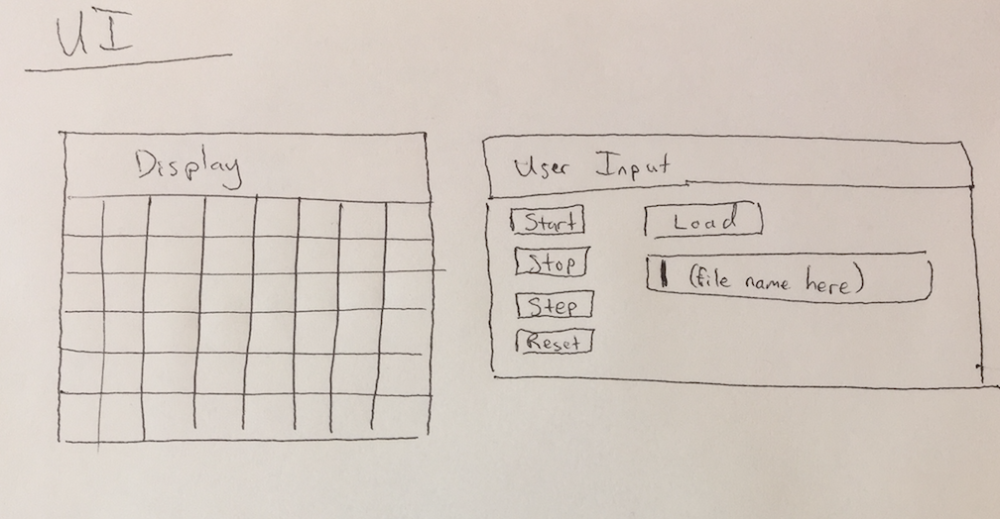

Introduction
===

In this project we will be designing a tool for visualizing Cellular Automata simulations. The goal for the program is for it to be able to simulate any rule that the user could want for any starting population that the user can specify. The simulation will be shown on a 2-D grid that should be flexible enough to display any number of cell states. The configuration of the simulation will be set by an input file formatted in XML. The user interface should provide the user with options to load this configuration file and begin the simulation.

Overview
===

The design is split into three broad categories: visualization, simulation, and configuration. The visualization components will make up the user interface and display the results of the simulation. The simulation components will contain the program logic and present the state of the cell society to the display after every step through the simulation. The configuration components will respond to requests from the user interface to load a new file, it will read the corresponding XML file, and it will set all of the user-specified parameters for the simulation.

User Interface
===

The primary functions of the user interface are to provide a means of loading the configuration file and to give the user control over stepping through the simulation. To select a configuration file, the user will specify the file by name and press a button to load it. Then the user will have options to run the simulation continuously or to step through it frame-by-frame. As the simulation progresses, the display should give feedback on how many steps have passed to reach the current state. To start over, the user can reset the simulation to its initial state. 

Design Details
===

The visualization component of the design will include the input and output. For output, we will have a Display class that contains methods to print out the grid given a data structure holding all the cells. For input, we will have a button class that can trigger events when clicked. Both of these objects will be instantiated in a GUIController class that connects them to the rest of the program. The state of the Cell Society will be kept in a Grid class that contains a data structure holding Cells. The Cell class will contain the state of each cell, and methods to update the state of the cells. Finally, we will have a FileReader class that is responsible for translating the XML input files.

Design Considerations
===

Team Responsibilities
===

