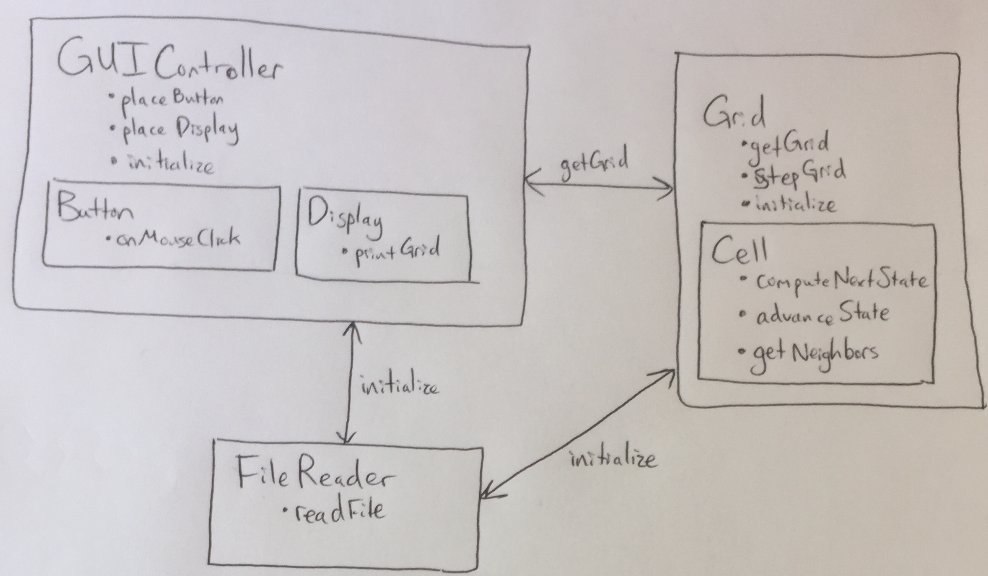

Introduction
===

In this project we will be designing a tool for visualizing Cellular Automata simulations. The goal for the program is for it to be able to simulate any rule that the user could want for any starting population that the user can specify. The simulation will be shown on a 2-D grid that should be flexible enough to display any number of cell states. The configuration of the simulation will be set by an input file formatted in XML. The user interface should provide the user with options to load this configuration file and begin the simulation.

Overview
===

The design is split into three broad categories: visualization, simulation, and configuration. The visualization components will make up the user interface and display the results of the simulation. The simulation components will contain the program logic and present the state of the cell society to the display after every step through the simulation. The configuration components will respond to requests from the user interface to load a new file, it will read the corresponding XML file, and it will set all of the user-specified parameters for the simulation.

User Interface
===

The primary functions of the user interface are to provide a means of loading the configuration file and to give the user control over stepping through the simulation. To select a configuration file, the user will specify the file by name and press a button to load it. Then the user will have options to run the simulation continuously or to step through it frame-by-frame. As the simulation progresses, the display should give feedback on how many steps have passed to reach the current state. To start over, the user can reset the simulation to its initial state. 

Design Details
===

The visualization component of the design will include the input and output. For output, we will have a Display class that contains methods to print out the grid given a data structure holding all the cells. 

For input, we will have a button class that can trigger events when clicked. Both of these objects will be instantiated in a GUIController class that connects them to the rest of the program. 

We will have a FileReader class that is responsible for translating the XML input files. This class will read in the data from the XML file and hand it off to the classes that need it. Specifically, the name and title of the simulation will be handed to the display, the configuration parameters will be handed to the grid and display, and the initial configuration of states will also be handed to the grid class. The rule will be handed to the cell class. 

The state of the Cell Society will be kept in a Grid class that contains a data structure holding Cells. The Grid class will have three main methods: getGrid(), stepGrid() and initialize(). 
initialize() will take the configuration data from FileReader and initialize a data structure with the initial grid. 
stepGrid() will be used to update all of the cells to their next states, which have been computed earlier with a for loop. 
getGrid() which will allow for the current state of the grid to be passed to the display. 

The Cell class will contain the current and next states of each cell, coordinates of said cell and methods to update the state of the cell based on the rule: computeNextState(), advanceState() and getNeighbors(). As the Grid class iterates through the grid data structure, it will call cell.getNeighbors(), which will return coordinates of each neighboring cell in a data structure. This data structure will then be passed to cell.computeNextState(), where the rule will be applied based on the neighbors to calculate the cell's next state. The advanceState() method will then take this computed next state and update the current and next states of each cell accordingly. Once this has been done for every cell, the grid has essentially been updated to contain the next state of every cell and the new grid will be passed to the display. 

Use Cases:
1. Apply the rules to a middle cell 
	To apply the rules to a middle cell, the Grid class will call cell.getNeighbors(), which will return a data structure of the coordinates of the cell's neighbors. These coordinates will then be passed to cell.computeNext() which will use the coordinates to get the states of the cells at those coordinates and compute the new state. This new state will become that cell's next state and the cell's existing next cell will become the cell's current state. 
2. Apply the rules to an edge cell
	Because we plan to use the coordinates of neighbors to update the state of any given cell, the process should be the same for the edge cells as the middle cells. We plan to ignore any null coordinates and just use the neighbors given to compute the next state of the given edge cell. 

Design Considerations
===

We have considered adding separate classes for cells on the edge of the simulation, but we think that probably reduces flexibility too much because it would directly limit cells from moving around the grid if they are not all of the same type.
We have also considered different solutions for how the cells figure out their neighboring cells. We think that this is something that can be handled in the Cell class, but it is possible we might have to move this up to the Grid class if it is too complicated to store this information in the Cell class.

Team Responsibilities
===

